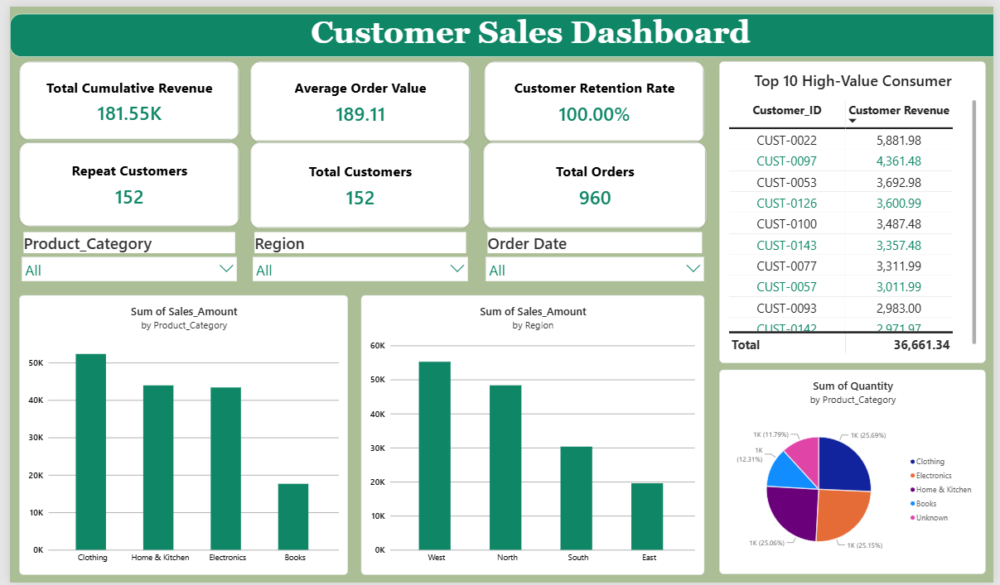

# instadot-internship-snehajaiswani-day4
# Customer Sales Analysis Dashboard

##  Project Overview

This project focuses on cleaning and analyzing a customer sales dataset using Python and Power BI. A data cleaning pipeline was developed to standardize the raw data, handle missing values, and prepare it for analysis. The cleaned dataset was then used to build an interactive dashboard with key business metrics and visual insights.

## 🛠️ Tools Used

* Python (Pandas)
* Power BI
* CSV Dataset

##  Data Cleaning Pipeline

The Python pipeline performs the following operations:

* Removes duplicate rows
* Handles missing values
* Standardizes date formats
* Cleans and formats `Customer_ID`, `Product_Category`, and `Region`
* Corrects invalid quantity and sales values
* Exports a cleaned dataset for analysis

## Dashboard Features

* Total Revenue KPI
* Average Order Value (AOV)
* Customer Retention Rate
* Total Orders
* Total Customers
* Repeat Customers
* Sales by Product Category
* Sales by Region
* Top 10 High-Value Customers
* Interactive slicers for Product Category, Region, and Date

##  Dashboard Preview

##  Key Insights

* The dashboard summarizes overall sales performance through interactive KPIs.
* Clothing is one of the strongest-performing product categories in the dataset.
* Customer spending patterns can be explored using the Top 10 High-Value Customers table.
* Regional analysis helps compare sales performance across different locations.

##  Project Files

* `pipeline.py` – Data cleaning pipeline
* `raw_customer_sales.csv` – Original dataset
* `cleaned_customer_sales.csv` – Cleaned dataset
* `Day4_Customer_Sales_Dashboard.pbix` – Power BI dashboard
* `dashboard_preview.png` – Dashboard screenshot

##  Outcome

This project demonstrates an end-to-end workflow: raw data preprocessing, data cleaning, KPI creation, and interactive dashboard development for business analysis.
